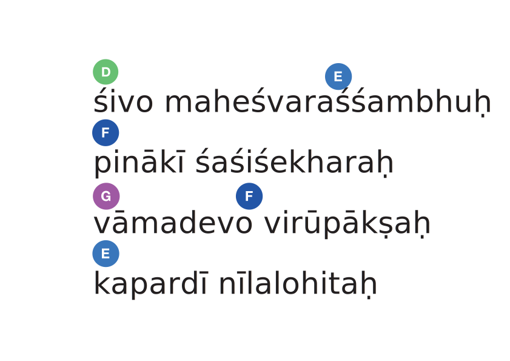

Стихотворный перевод с санскрита: NN.

::: stanza 1

शिवो महेश्वरश्शम्भुः पिनाकी शशिशेखरः ।       
वामदेवो विरूपाक्षः कपर्दी नीललोहितः ॥१॥ {sans}

śivo maheśvaraśśambhuḥ pinākī śaśiśekharaḥ ।        
vāmadevo virūpākṣaḥ kapardī nīlalohitaḥ ॥1॥ {trans}

Дарящий счастье царь, благой; 
Кто лучник, убранный луной; 
Прекрасен, необычноок, 
Кроваво-красен, власья в клок.

:::
::: stanza 2

शङ्करश्शूलपाणिश्च खट्वाङ्गी विष्णुवल्लभः ।       
शिपिविष्टोऽम्बिकानाथः श्रीकण्ठो भक्तवत्सलः ॥२॥ {sans}

śaṅkaraśśūlapāṇiśca khaṭvāṅgī viṣṇuvallabhaḥ ।        
śipiviṣṭo'mbikānāthaḥ śrīkaṇṭho bhaktavatsalaḥ ॥2॥ {trans}

Владелец жезла и копья; 
Богини муж, исток бытья, 
Прекрасношеий, чистый свет, 
Услады преданных предмет.

:::
::: stanza 3

भवश्शर्वस्त्रिलोकेशश्शितिकण्ठश्शिवप्रियः ।       
उग्रः कपाली कामारी अन्धकासुरसूदनः ॥३॥ {sans}

bhavaśśarvastrilokeśaśśitikaṇṭhaśśivapriyaḥ ।        
ugraḥ kapālī kāmārī andhakāsurasūdanaḥ ॥3॥ {trans}

Стрелой разящий; капалин; 
Бытье; трехмирья властелин.
Желаний враг, Андхаки мор; 
Сам ужас, любый дщери гор.

:::
::: stanza 4

गङ्गाधरो ललाटाक्षः कालकालः कृपानिधिः ।       
भीमः परशुहस्तश्च मृगपाणिर्जटाधरः ॥४॥ {sans}

gaṅgādharo lalāṭākṣaḥ kālakālaḥ kṛpānidhiḥ ।        
bhīmaḥ paraśuhastaśca mṛgapāṇirjaṭādharaḥ ॥4॥ {trans}

Держащий Гангу, смерти мор, 
Во лбу чьем глаз, в руке топор.
Огромен, милости колосс.
Лань держит, спутанноволос.

:::
::: stanza 5

कैलासवासी कवची कठोरस्त्रिपुरान्तकः ।       
वृषाङ्को वृषभारूढो भस्मोद्धूलितविग्रहः ॥५॥ {sans}

kailāsavāsī kavacī kaṭhorastripurāntakaḥ ।        
vṛṣāṅko vṛṣabhārūḍho bhasmoddhūlitavigrahaḥ ॥5॥ {trans}

Живущий на горе святой, 
Муж в пепле, на быке, густой.
Три града ввергнувший в конец; 
В броню одетый и венец.

:::
::: stanza 6

सामप्रियस्स्वरमयस्त्रयीमूर्तिरनीश्वरः ।       
सर्वज्ञः परमात्मा च सोमसूर्याग्निलोचनः ॥६॥ {sans}

sāmapriyassvaramayastrayīmūrtiranīśvaraḥ ।        
sarvajñaḥ paramātmā ca somasūryāgnilocanaḥ ॥6॥ {trans}

Трехлик, любящий рифмы слог.
Звучанье, неподвластный Бог.
Дух высший и знаток всего; 
Светила все - глаза Его.

:::
::: stanza 7

हविर्यज्ञमयस्सोमः पञ्चवक्त्रस्सदाशिवः ।       
विश्वेश्वरो वीरभद्रो गणनाथः प्रजापतिः ॥७॥ {sans}

haviryajñamayassomaḥ pañcavaktrassadāśivaḥ ।        
viśveśvaro vīrabhadro gaṇanāthaḥ prajāpatiḥ ॥7॥ {trans}

Огонь, что с Умою един, 
Приемлет жертвы, господин.
Кто пятилик, всегда благой.
Царь духам; предок и герой.

:::
::: stanza 8

हिरण्यरेतः दुर्धर्षः गिरीशो गिरिशोनघः ।       
भुजङ्गभूषणो भर्गो गिरिधन्वा गिरिप्रियः ॥८॥ {sans}

hiraṇyaretaḥ durdharṣaḥ girīśo giriśonaghaḥ ।        
bhujaṅgabhūṣaṇo bhargo giridhanvā giripriyaḥ ॥8॥ {trans}

Златое семя у Кого, 
Непросто оскорбить Его, 
Змеей украшен, славен; гор
Владыка, житель и убор.

:::
::: stanza 9

कृत्तिवासः पुरातनर्भगवान् प्रमथाधिपः ।       
मृत्युञ्जयस्सूक्ष्मतनुर्जगद्व्यापी जगद्गुरुः ॥९॥ {sans}

kṛttivāsaḥ purātanarbhagavān pramathādhipaḥ ।        
mṛtyuñjayassūkṣmatanurjagadvyāpī jagadguruḥ ॥9॥ {trans}

Бог древний, смерть что победил, 
Собою всё заполонил.
Миров учитель, духов царь; 
Кто тоньше, чем любая тварь.

:::
::: stanza 10

व्योमकेशो महासेनजनकश्चारुविक्रमः ।       
रुद्रो भूतपतिः स्थाणुरहिर्भुध्नो दिगम्बरः ॥१०॥ {sans}

vyomakeśo mahāsenajanakaścāruvikramaḥ ।        
rudro bhūtapatiḥ sthāṇurahirbhudhno digambaraḥ ॥10॥ {trans}

Небесновласый, милый путь; 
Отец воителя и Суть.
Владыка всех, чей рёв суров.
Одетый в небо, ось миров.

:::
::: stanza 11

अष्टमूर्तिरनेकात्मा सात्त्विकश्शुद्धविग्रहः ।       
शाश्वतः खण्डपरशुरजः पाशविमोचकः ॥११॥ {sans}

aṣṭamūrtiranekātmā sāttvikaśśuddhavigrahaḥ ।        
śāśvataḥ khaṇḍaparaśurajaḥ pāśavimocakaḥ ॥11॥ {trans}

Восьмиобразен, многочтим, 
Реален, чист, неоскверним.
Рубящий узы, как топор, 
Непобеждённый до сих пор.

:::
::: stanza 12

मृडः पशुपतिर्देवो महादेवोऽव्ययो हरिः ।       
भगनेत्रभिदव्यक्तो दक्षाध्वरहरो हरः ॥१२॥ {sans}

mṛḍaḥ paśupatirdevo mahādevo'vyayo hariḥ ।        
bhaganetrabhidavyakto dakṣādhvaraharo haraḥ ॥12॥ {trans}

Добрейший пастырь душам всем, 
Неизменяемый совсем.
Великий бог, в оленя цвет, 
Обряд что Дакши свёл на нет.

:::
::: stanza 13

पूषदन्तभिदव्यग्रो सहस्राक्षस्सहस्रपात् ।       
अपवर्गप्रदोऽनन्तस्तारकः परमेश्वरः ॥१३॥ {sans}

pūṣadantabhidavyagro sahasrākṣassahasrapāt ।        
apavargaprado'nantastārakaḥ parameśvaraḥ ॥13॥ {trans}

Тысяченог, тысячеглаз, 
у Пуши зуб, у Бхаги глаз
Он выбил, сам хотя - покой...
Спаситель, Бог Всевышний мой.

:::

::: stanza 14

इति श्री शिवाष्टोत्तरशतनामस्त्रोत्रम् समाप्तम् ॥॥ {sans}

iti śrī śivāṣṭottaraśatanāmastrotram samāptam ॥ {trans}

Таково стовосьмиимённое восхваление Шивы
:::

::: stanza

## Поимённый перевод с санскрита: Савитри Деви

<table class="names">
<tbody>
<tr>
<td>№</td>
<td>Деванагари</td>
<td>Транслитерация</td>
<td>Перевод на русский</td>
</tr>
<tr>
<td>1</td>
<td>ॐ शिवाय नमः</td>
<td>om śivāya namaḥ</td>
<td>Благой</td>
</tr>
<tr>
<td>2</td>
<td>ॐ महेश्वराय नमः</td>
<td>om maheśvarāya namaḥ</td>
<td>Верховный владыка</td>
</tr>
<tr>
<td>3</td>
<td>ॐ शंभवे नमः</td>
<td>om śaṁbhave namaḥ</td>
<td>Осчастливливающий</td>
</tr>
<tr>
<td>4</td>
<td>ॐ पिनाकिने नमः</td>
<td>om pinākine namaḥ</td>
<td>Вооружённый магическим луком</td>
</tr>
<tr>
<td>5</td>
<td>ॐ शशिशेखराय नमः</td>
<td>om śaśiśekharāya namaḥ</td>
<td>Носящий полумесяц в волосах</td>
</tr>
<tr>
<td>6</td>
<td>ॐ वामदेवाय नमः</td>
<td>om vāmadevāya namaḥ</td>
<td>Великодушнейший</td>
</tr>
<tr>
<td>7</td>
<td>ॐ विरुपाक्षाय नमः</td>
<td>om virupākṣāya namaḥ</td>
<td>Воплощение бесформенного</td>
</tr>
<tr>
<td>8</td>
<td>ॐ कपर्दिने नमः</td>
<td>om kapardine namaḥ</td>
<td>Косматый (с взлохмаченными волосами)</td>
</tr>
<tr>
<td>9</td>
<td>ॐ नीललोहिताय नमः</td>
<td>om nīlalohitāya namaḥ</td>
<td>Сине-Красно-Пурпурно-Фиолетовый</td>
</tr>
<tr>
<td>10</td>
<td>ॐ शंकराय नमः</td>
<td>om śaṁkarāya namaḥ</td>
<td>Источник процветания</td>
</tr>
<tr>
<td>11</td>
<td>ॐ शूलपाणये</td>
<td>om śūlapāṇaye namaḥ</td>
<td>Имеющий трезубец</td>
</tr>
<tr>
<td>12</td>
<td>ॐ खट्वांगिने नमः</td>
<td>om khaṭvāṁgine namaḥ</td>
<td>Носящий на палке череп</td>
</tr>
<tr>
<td>13</td>
<td>ॐ विष्णुवल्लभाय नमः</td>
<td>om viṣṇuvallabhāya namaḥ</td>
<td>Любимый богом Вишну</td>
</tr>
<tr>
<td>14</td>
<td>ॐ शिपिविष्टाय नमः</td>
<td>om śipiviṣṭāya namaḥ</td>
<td>Пронизывающий лучами</td>
</tr>
<tr>
<td>15</td>
<td>ॐ अंबिकानाथाय नमः</td>
<td>om aṁbikānāthāya namaḥ</td>
<td>Супруг Амбики</td>
</tr>
<tr>
<td>16</td>
<td>ॐ श्रीकण्ठाय नमः</td>
<td>om śrīkaṇṭhāya namaḥ</td>
<td>Имеющий благостное горло</td>
</tr>
<tr>
<td>17</td>
<td>ॐ भक्तवत्सलाय नमः</td>
<td>om bhaktavatsalāya namaḥ</td>
<td>Любящий своих последователей как своих детей</td>
</tr>
<tr>
<td>18</td>
<td>ॐ भवाय नमः</td>
<td>om bhavāya namaḥ</td>
<td>Восхитительный</td>
</tr>
<tr>
<td>19</td>
<td>ॐ शर्वाय नमः</td>
<td>om śarvāya namaḥ</td>
<td>Сокрушающий все цели</td>
</tr>
<tr>
<td>20</td>
<td>ॐ त्रिलोकेशाय नमः</td>
<td>om trilokeśāya namaḥ</td>
<td>Повелевающийтремя мирами</td>
</tr>
<tr>
<td>21</td>
<td>ॐ शितिकण्ठाय नमः</td>
<td>om śitikaṇṭhāya namaḥ</td>
<td>С посиневшим горлом</td>
</tr>
<tr>
<td>22</td>
<td>ॐ शिवा प्रियाय नमः</td>
<td>om śivā priyāya namaḥ</td>
<td>Любимый Шива</td>
</tr>
<tr>
<td>23</td>
<td>ॐ उग्राय नमः</td>
<td>om ugrāya namaḥ</td>
<td>Свирепый</td>
</tr>
<tr>
<td>24</td>
<td>ॐ कपालिने नमः</td>
<td>om kapāline namaḥ</td>
<td>Носящий черепа</td>
</tr>
<tr>
<td>25</td>
<td>ॐ कामारये नमः</td>
<td>om kāmāraye namaḥ</td>
<td>Уничтоживший бога любви Каму (персонификация страсти)</td>
</tr>
<tr>
<td>26</td>
<td>ॐ अन्धकासुरसुदनाय नमः</td>
<td>om andhakāsurasudanāya namaḥ</td>
<td>Убивший асура Андхаку</td>
</tr>
<tr>
<td>27</td>
<td>ॐ गंगाधराय नमः</td>
<td>om gaṁgādharāya namaḥ</td>
<td>Держащий Гангу</td>
</tr>
<tr>
<td>28</td>
<td>ॐ ललाटाक्षाय नमः</td>
<td>om lalāṭākṣāya namaḥ</td>
<td>Являющийся центром игры</td>
</tr>
<tr>
<td>29</td>
<td>ॐ कालकालाय नमः</td>
<td>om kālakālāya namaḥ</td>
<td>Время времён</td>
</tr>
<tr>
<td>30</td>
<td>ॐ कृपानिधये नमः</td>
<td>om kṛpānidhaye namaḥ</td>
<td>Льющий благо</td>
</tr>
<tr>
<td>31</td>
<td>ॐ भीमाय नमः</td>
<td>om bhīmāya namaḥ</td>
<td>Ужасающий</td>
</tr>
<tr>
<td>32</td>
<td>ॐ परशुहस्ताय नमः</td>
<td>om paraśuhastāya namaḥ</td>
<td>Орудующий топором</td>
</tr>
<tr>
<td>33</td>
<td>ॐ मृगपाणये नमः</td>
<td>om mṛgapāṇaye namaḥ</td>
<td>Ведущий животных</td>
</tr>
<tr>
<td>34</td>
<td>ॐ जटधराय नमः</td>
<td>om jaṭadharāya namaḥ</td>
<td>Носящий спутанные волосы</td>
</tr>
<tr>
<td>35</td>
<td>ॐ कैलाशवासिने नमः</td>
<td>om kailāśavāsine namaḥ</td>
<td>Обитающий на горе Кайлас</td>
</tr>
<tr>
<td>36</td>
<td>ॐ कवचिने नमः</td>
<td>om kavacine namaḥ</td>
<td>Покрытый броней</td>
</tr>
<tr>
<td>37</td>
<td>ॐ कटोराय नमः</td>
<td>om kaṭorāya namaḥ</td>
<td>Причина расцветания и роста</td>
</tr>
<tr>
<td>38</td>
<td>ॐ त्रिपुरान्तकाय नमः</td>
<td>om tripurāntakāya namaḥ</td>
<td>Разрушитель Трипуры (городов демонов).</td>
</tr>
<tr>
<td>39</td>
<td>ॐ वृषांकाय नमः</td>
<td>om vṛṣāṁkāya namaḥ</td>
<td>Имеющий знак быка</td>
</tr>
<tr>
<td>40</td>
<td>ॐ वृष्भारूढाय नमः</td>
<td>om vṛṣbhārūḍhāya namaḥ</td>
<td>Сидящий на быке</td>
</tr>
<tr>
<td>41</td>
<td>ॐ भस्मोद्धूलित विग्रहाय नमः</td>
<td>om bhasmoddhūlita vigrahāya namaḥ</td>
<td>Посыпавший тело пеплом</td>
</tr>
<tr>
<td>42</td>
<td>ॐ समप्रियाय नमः</td>
<td>om samapriyāya namaḥ</td>
<td>Относящийся ко всем одинаково дружественно как к самому себе</td>
</tr>
<tr>
<td>43</td>
<td>ॐ स्वरमयाय नमः</td>
<td>om svaramayāya namaḥ</td>
<td>Творящий звуком</td>
</tr>
<tr>
<td>44</td>
<td>ॐ त्रयीमूर्तय नमः</td>
<td>om trayīmūrtaya namaḥ</td>
<td>Трёхформенный</td>
</tr>
<tr>
<td>45</td>
<td>ॐ अनीश्वराय नमः</td>
<td>om anīśvarāya namaḥ</td>
<td>Никем не управляемый</td>
</tr>
<tr>
<td>46</td>
<td>ॐ सर्वज्ञाय नमः</td>
<td>om sarvajñāya namaḥ</td>
<td>Всезнающий</td>
</tr>
<tr>
<td>47</td>
<td>ॐ परमत्मने नमः</td>
<td>om paramatmane namaḥ</td>
<td>Сверхдуша</td>
</tr>
<tr>
<td>48</td>
<td>ॐ सोमसूर्याग्निलोचनाय नमः</td>
<td>om somasūryāgnilocanāya namaḥ</td>
<td>Лунный, солнечный, огненный взгляд</td>
</tr>
<tr>
<td>49</td>
<td>ॐ हविषे नमः</td>
<td>om haviṣe namaḥ</td>
<td>Принимающий жертвоприношение</td>
</tr>
<tr>
<td>50</td>
<td>ॐ यज्ञमयाय नमः</td>
<td>om yajñamayāya namaḥ</td>
<td>Суть ритуалов и жертв</td>
</tr>
<tr>
<td>51</td>
<td>ॐ सोमाय नमः</td>
<td>om somāya namaḥ</td>
<td>Нектар Сомы</td>
</tr>
<tr>
<td>52</td>
<td>ॐ पंचवक्त्राय नमः</td>
<td>om paṁcavaktrāya namaḥ</td>
<td>Пятиликий</td>
</tr>
<tr>
<td>53</td>
<td>ॐ सदाशिवाय नमः</td>
<td>om sadāśivāya namaḥ</td>
<td>Вечный Шива</td>
</tr>
<tr>
<td>54</td>
<td>ॐ विश्वेश्वराय नमः</td>
<td>om viśveśvarāya namaḥ</td>
<td>Вселенский правитель</td>
</tr>
<tr>
<td>55</td>
<td>ॐ वीरभद्राय नमः</td>
<td>om vīrabhadrāya namaḥ</td>
<td>Великий герой</td>
</tr>
<tr>
<td>56</td>
<td>ॐ गणनाथाय नमः</td>
<td>om gaṇanāthāya namaḥ</td>
<td>Повелитель Ганов</td>
</tr>
<tr>
<td>57</td>
<td>ॐ प्रजापतये नमः</td>
<td>om prajāpataye namaḥ</td>
<td>Творец всех существ</td>
</tr>
<tr>
<td>58</td>
<td>ॐ हिरण्यरेतसे नमः</td>
<td>om hiraṇyaretase namaḥ</td>
<td>Золотое семя</td>
</tr>
<tr>
<td>59</td>
<td>ॐ दुर्धर्षाय नमः</td>
<td>om durdharṣāya namaḥ</td>
<td>Недоступный</td>
</tr>
<tr>
<td>60</td>
<td>ॐ गिरीशाय नमः</td>
<td>om girīśāya namaḥ</td>
<td>Повелитель гор</td>
</tr>
<tr>
<td>61</td>
<td>ॐ गिरिशाय नमः</td>
<td>om giriśāya namaḥ</td>
<td>Обитатель гор</td>
</tr>
<tr>
<td>62</td>
<td>ॐ अनघाय नमः</td>
<td>om anaghāya namaḥ</td>
<td>Безупречный</td>
</tr>
<tr>
<td>63</td>
<td>ॐ भुजंगभूषणाय नमः</td>
<td>om bhujaṁgabhūṣaṇāya namaḥ</td>
<td>Украшенный змеями</td>
</tr>
<tr>
<td>64</td>
<td>ॐ भर्गाय नमः</td>
<td>om bhargāya namaḥ</td>
<td>Сияющий</td>
</tr>
<tr>
<td>65</td>
<td>ॐ गिरिधन्वने नमः</td>
<td>om giridhanvane namaḥ</td>
<td>Использующий гору как лук</td>
</tr>
<tr>
<td>66</td>
<td>ॐ गिरिप्रियाय नमः</td>
<td>om giripriyāya namaḥ</td>
<td>Возлюбленный гор</td>
</tr>
<tr>
<td>67</td>
<td>ॐ कृत्तवाससे नमः</td>
<td>om kṛttavāsase namaḥ</td>
<td>Одетый в шкуру</td>
</tr>
<tr>
<td>68</td>
<td>ॐ पुरारातये नमः</td>
<td>om purārātaye namaḥ</td>
<td>Разрушитель городов</td>
</tr>
<tr>
<td>69</td>
<td>ॐ भगवते नमः</td>
<td>om bhagavate namaḥ</td>
<td>Божественный</td>
</tr>
<tr>
<td>70</td>
<td>ॐ प्रमथाधिपाय नमः</td>
<td>om pramathādhipāya namaḥ</td>
<td>Повелитель злых духов</td>
</tr>
<tr>
<td>71</td>
<td>ॐ मृत्युंजयाय नमः</td>
<td>om mṛtyuṁjayāya namaḥ</td>
<td>Победитель смерти</td>
</tr>
<tr>
<td>72</td>
<td>ॐ सूक्ष्मतनवे नमः</td>
<td>om sūkṣmatanave namaḥ</td>
<td>Тончайший</td>
</tr>
<tr>
<td>73</td>
<td>ॐ जगद्व्यापिने नमः</td>
<td>om jagadvyāpine namaḥ</td>
<td>Наполняющий Вселенную</td>
</tr>
<tr>
<td>74</td>
<td>ॐ जगद्गुरुवे नमः</td>
<td>om jagadguruve namaḥ</td>
<td>Вселенский гуру</td>
</tr>
<tr>
<td>75</td>
<td>ॐ व्योमकेशाय नमः</td>
<td>om vyomakeśāya namaḥ</td>
<td>С волосами как небо</td>
</tr>
<tr>
<td>76</td>
<td>ॐ महासेनजनकाय नमः</td>
<td>om mahāsenajanakāya namaḥ</td>
<td>Отец Махасены (Сканды)</td>
</tr>
<tr>
<td>77</td>
<td>ॐ चारुविक्रमाय नमः</td>
<td>om cāruvikramāya namaḥ</td>
<td>Источающий красоту</td>
</tr>
<tr>
<td>78</td>
<td>ॐ रुद्राय नमः</td>
<td>om rudrāya namaḥ</td>
<td>Ревущий Рудра</td>
</tr>
<tr>
<td>79</td>
<td>ॐ भूतपतये नमः</td>
<td>om bhūtapataye namaḥ</td>
<td>Повелитель всех живых существ</td>
</tr>
<tr>
<td>80</td>
<td>ॐ स्थाणवे नमः</td>
<td>om sthāṇave namaḥ</td>
<td>Неподвижный</td>
</tr>
<tr>
<td>81</td>
<td>ॐ अहयेबुध्न्याय नमः</td>
<td>om ahayebudhnyāya namaḥ</td>
<td>Змея в основе мира</td>
</tr>
<tr>
<td>82</td>
<td>ॐ दिगंबराय नमः</td>
<td>om digaṁbarāya namaḥ</td>
<td>Одетый в небо (Обнажённый)</td>
</tr>
<tr>
<td>83</td>
<td>ॐ अष्टमूर्तये नमः</td>
<td>om aṣṭamūrtaye namaḥ</td>
<td>Восьмиформенный</td>
</tr>
<tr>
<td>84</td>
<td>ॐ अनेकात्मने नमः</td>
<td>om anekātmane namaḥ</td>
<td>Находящийся во всех душах</td>
</tr>
<tr>
<td>85</td>
<td>ॐ सात्विकाय नमः</td>
<td>om sāttvikāya namaḥ</td>
<td>Праведный</td>
</tr>
<tr>
<td>86</td>
<td>ॐ शुद्धविग्रहाय नमः</td>
<td>om śuddhavigrahāya namaḥ</td>
<td>Чистейший</td>
</tr>
<tr>
<td>87</td>
<td>ॐ शाश्वताय नमः</td>
<td>om śāśvatāya namaḥ</td>
<td>Постоянный и неизменный</td>
</tr>
<tr>
<td>88</td>
<td>ॐ खण्डपरशवे नमः</td>
<td>om khaṇḍaparaśave namaḥ</td>
<td>Разрубающий</td>
</tr>
<tr>
<td>89</td>
<td>ॐ अज्ञाय नमः</td>
<td>om ajāya namaḥ</td>
<td>Нерожденный</td>
</tr>
<tr>
<td>90</td>
<td>ॐ पाशविमोचकाय नमः</td>
<td>om pāśavimocakāya namaḥ</td>
<td>Избавляющий от оков</td>
</tr>
<tr>
<td>91</td>
<td>ॐ मृडाय नमः</td>
<td>om mṛḍāya namaḥ</td>
<td>Обходительный</td>
</tr>
<tr>
<td>92</td>
<td>ॐ पशुपतये नमः</td>
<td>om paśupataye namaḥ</td>
<td>Повелитель животных</td>
</tr>
<tr>
<td>93</td>
<td>ॐ देवाय नमः</td>
<td>om devāya namaḥ</td>
<td>Бог</td>
</tr>
<tr>
<td>94</td>
<td>ॐ महादेवाय नमः</td>
<td>om mahādevāya namaḥ</td>
<td>Бог богов</td>
</tr>
<tr>
<td>95</td>
<td>ॐ अव्ययाय नमः</td>
<td>om avyayāya namaḥ</td>
<td>Неизменный</td>
</tr>
<tr>
<td>96</td>
<td>ॐ हरये नमः</td>
<td>om haraye namaḥ</td>
<td>Хара</td>
</tr>
<tr>
<td>97</td>
<td>ॐ भगनेत्रभिदे नमः</td>
<td>om bhaganetrabhide namaḥ</td>
<td>Уничтожитель бхагов</td>
</tr>
<tr>
<td>98</td>
<td>ॐ अव्यक्ताय नमः</td>
<td>om avyaktāya namaḥ</td>
<td>Невидимый</td>
</tr>
<tr>
<td>99</td>
<td>ॐ दक्षध्वरहराय नमः</td>
<td>om dakṣadhvaraharāya namaḥ</td>
<td>Уничтоживший жертвоприношение Дакши</td>
</tr>
<tr>
<td>100</td>
<td>ॐ हराय नमः</td>
<td>om harāya namaḥ</td>
<td>Разрушающий</td>
</tr>
<tr>
<td>101</td>
<td>ॐ पूषदन्तभिदे नमः</td>
<td>om pūṣadantabhide namaḥ</td>
<td>Устраняющий заблуждения</td>
</tr>
<tr>
<td>102</td>
<td>ॐ अव्यग्राय नमः</td>
<td>om avyagrāya namaḥ</td>
<td>Непроявленный</td>
</tr>
<tr>
<td>103</td>
<td>ॐ सहस्राक्षाय नमः</td>
<td>om sahasrākṣāya namaḥ</td>
<td>Тысячеглазый (Имеющий тысячу осей)</td>
</tr>
<tr>
<td>104</td>
<td>ॐ सहस्रपदे नमः</td>
<td>om sahasrapade namaḥ</td>
<td>Тысяченогий</td>
</tr>
<tr>
<td>105</td>
<td>ॐ अपवर्गप्रदाय नमः</td>
<td>om apavargapradāya namaḥ</td>
<td>Дающий и берущий</td>
</tr>
<tr>
<td>106</td>
<td>ॐ अनन्ताय नमः</td>
<td>om anantāya namaḥ</td>
<td>Бесконечный</td>
</tr>
<tr>
<td>107</td>
<td>ॐ तारकाय नमः</td>
<td>om tārakāya namaḥ</td>
<td>Освобождающий</td>
</tr>
<tr>
<td>108</td>
<td>ॐ परमेश्वराय नमः</td>
<td>om parameśvarāya namaḥ</td>
<td>Верховный господь</td>
</tr>
</tbody>
</table>

:::
