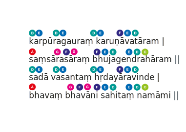

[sans]कर्पूरगौरं करुणावतारम् ।
संसारसारं भुजगेन्द्रहारम् ॥
सदा वसन्तं हृदयारविन्दे ।
भवं भवानि सहितं नमामि ॥ [/sans]
[trans]karpūragauraṃ karuṇāvatāram ।
saṃsārasāraṃ bhujagendrahāram ॥
sadā vasantaṃ hṛdayāravinde ।
bhavaṃ bhavāni sahitaṃ namāmi ॥ [/trans]

Белоснежному как камфора, Воплощению сострадания,   
Сущности мироздания, украшенному Царем змей,    
Всегда обитающему в лотосе моего сердца,    
Бхаве-Шиве вместе с Бхавани-Шакти я поклоняюсь.   
[small]— Прозаический перевод с санскрита: Шив Рагини [/small]

Камфарно чист; состраданье сулящий.
Суть бытия; царя змеев носящий.
Юный; и в лотосе сердца живущий...
Поклон мой да будет Сущему с Сущей.   
[small]— Стихотворный перевод с санскрита: NN.[/small]

### Вариант аккомпанемента

