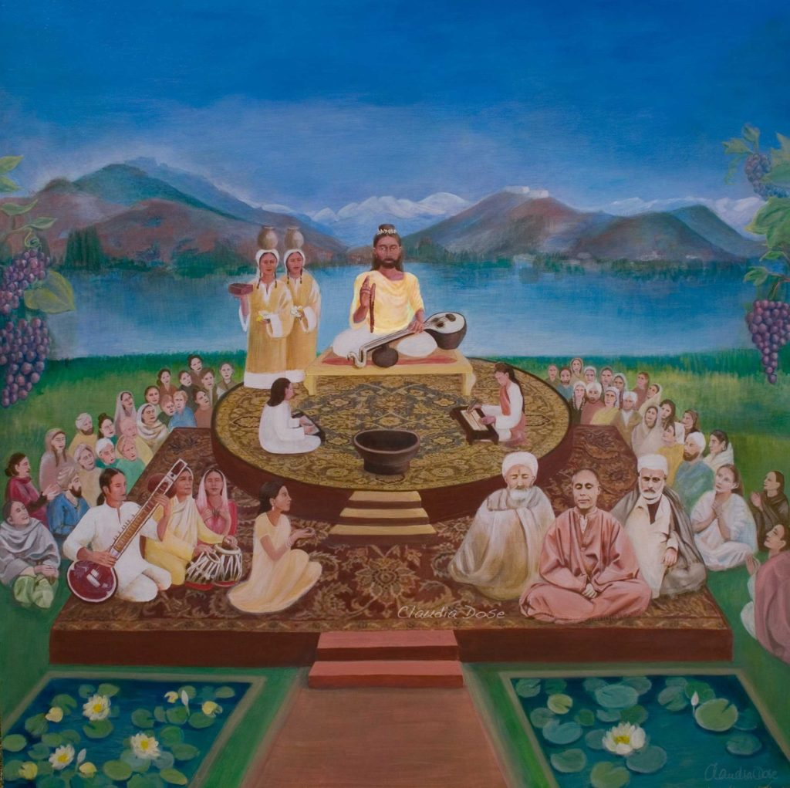

Индийский философ, мистик и автор работ по эстетике. Занимался музыкой, писал стихи, пьесы, толкования на древние тексты, был богословом и логиком. Оказал сильное влияние на индийскую культуру.

Родился в Кашмире в семье ученых и мистиков, изучал философию и искусство в течение пятнадцати лет. После себя он оставил более 35 законченных работ, самой известной из которых является «Тантралока» (энциклопедический трактат о всех философских и практических аспектах учения, известного сегодня как Кашмирский шиваизм, Трика и Каула). Внёс важный вклад в философию эстетики (разъяснения комментариев Абхинавабхараты к «Натьяшастре» Бхараты муни).

## Гений своего времени

Имя «Абхинавагупта» не было его исконным именем, скорее всего это титул, который несёт значение «компетентности и авторитетности». Анализируя значение этого имени Яйаратха (один из самых значительных комментаторов Абхинавагупты) также показывает ещё три значения: «быть бдительным», «присутствовать всюду» и «защищенный похвалами». Раньеро Гноли, единственный санскритолог, который закончил перевод Тантралоку на европейский язык, упоминает что «Абхинавагупта» также означает «новый», что может указывать на новизну его мистического опыта. От Яйаратха мы узнаем, что Абхинавагупта обладал всеми шестью качествами, требуемыми для достижения высочайшего мистического опыта в шактопайе, как описано в священных текстах «Шрипурвашастры»:

- неустрашимая вера в Бога,
- реализация молитв,
- управление реальностью посредством обращения к 36 таттвам,
- успешное завершение всех предпринятых действий,
- поэтически-творческий потенциал
- и непосредственное знание всех дисциплин.

Работы Абхинавагупты хорошо уравновешены между ветвями триады (Трика): ичха (воля), гьяна (знание) и крийя (действие), что проявилось в его религиозных гимнах, философских работах, в описание методов, относящихся к йоге. Он восстановил, рационализировал и организовал философское знание в более последовательную форму, исходя из всех доступных источников своего времени.

Различные современные ученые характеризовали Абхиванагупту как: «блестящий учёный и святой», «основоположник развития кашмирского шиваизма» и «блестящий реализатор йогических практик».

## Жизнь

### «Чудесное» рождение

Термины, которыми сам Абхинавагупта определяет условия своего рождения: «зачатый йогиней от йога йогическим способом». В Кашмирском шиваизме полагают, что он являлся аватарой Бхайравы, и обладал исключительным духовным и интеллектуальным уровнем. Такой ребёнок должен быть «хранилищем знания» того, чью форму «ребёнок имеет в матке» — «форму Шивы», что служило одним из признаков его божественности.

### Родители

Родители Абхинавагупты происходили из благородных семей брахманов, они были глубоко преданы служению Богу и обладали высокой учёностью. Его мать Вимала (Вималакала) умерла, когда Абхинавагупте было только два года; потеря матери, к которой он был очень привязан, усилила его отрешённость от мира и привела к большей сосредоточенности на духовном. Его отец Нарасимхагупта после смерти своей жены вёл аскетический образ жизни, воспитывая трех детей. Он имел высокую образованность и «сердце, преисполненное преданностью Махешваре» (по собственным словам Абхинавагупты). Отец был первым его учителем, занимаясь с ним грамматикой, логикой и литературой.

### Семья и приверженцы

У Абхинавагупты были брат и сестра. Брат Манората был ревностным приверженцем Шивы. Его сестра Амба посвятила себя целиком служению божеству после смерти своего мужа. Его двоюродный брат Карна ещё в юности проникся идеями шиваизма, глубоко познавши их суть. Его жена была по-видимому старшей сестрой Абхинавагупты Амба. У Амбы и Карны был сын Йогишваридатта, что означает человека, добившегося больших успехов в йоге (йогишвар — буквально «господин йоги»).

Абхинавагупта также упоминает своего ученика Рамадеву как искренне преданного духовным исследованиям и своему учителю. Другого двоюродного брата звали Кшема, возможно он и есть прославленный ученик Абхинавагупты Кшемараджа. Мандра, друг детства Карны, был хозяином пригородного поместья, где часто жил Абхинавагупта. Он был не только богат и приятен в общении, но также был приверженцем знания. И он, и его тётя Ваташика упоминаются Абхинавагуптой с большой благодарностью, так как они заботились о нём с большой тщательностью, а от Ваташики он получил денежную помощь, что позволило ему заниматься своей работой спокойно. Благодаря своему окружению Абхинавагупта смог завершить такое грандиозное произведение как «Тантралока».

[Wikipedia](https://ru.wikipedia.org/wiki/%D0%90%D0%B1%D1%85%D0%B8%D0%BD%D0%B0%D0%B2%D0%B0%D0%B3%D1%83%D0%BF%D1%82%D0%B0)

