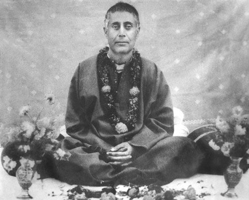
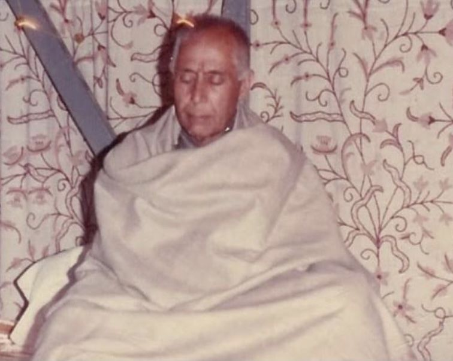
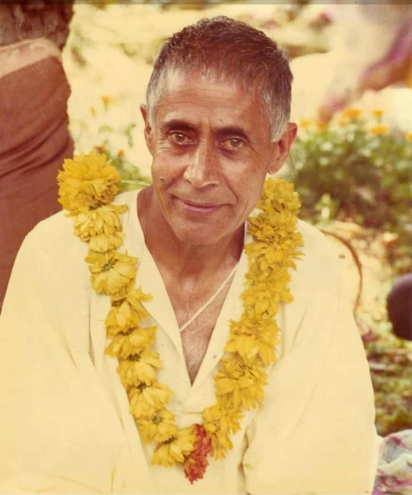
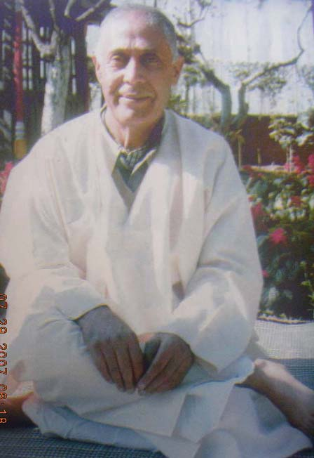

::: stanza 

[Wikipedia](https://en.wikipedia.org/wiki/Lakshman_Joo)

He was known as Lal Sahib ("Friend of God") by followers.

## Biography

Lakshman Joo was born in a Kashmiri Hindu Brahmin family in the city of Srinagar in Kashmir. He was the fifth child in a household of four boys and five girls. His father, Narayandas ("Nav Narayan") Raina, was the first person to have introduced houseboats in the Kashmir Valley.[citation needed] His mother's name was Arnyamali Raina.

At the age of five he was introduced to the path of spirituality by his elder brother Maheshvaranath. Up to the age of eight his spiritual progress in the lineage of Kashmiri Shaivam was monitored by his family priest, Pandit Swami Ram Joo (1854-1915), and later by his chief disciple Swami Mehatab Kak (1870?-1942). At the age of 19, it is said, he experienced a clear taste of Self-realisation. Shortly afterwards he left home, as he wrote, "in search of the Supreme" and moved to the famous ashram of Sadhamalyun (Sadhuganga) in Handwara. Persuaded by his father to return to Srinagar, he continued to study Sanskrit and Shaiva philosophy under the guidance of a scholar named Maheshwar Razdan.

From 1934 to 1935, Lakshman Joo moved to an isolated place above the village of Gupta Ganga near Nishat suburb of Srinagar where his parents built him a house. This was a place where Abhinavagupta had lived nine centuries before. In 1962 he moved down the hill to a place closer to the famous Dal Lake a few hundred metres from the Nishat Gardens. Around the age of 30 Lakshman Joo traveled in India, spending time on a Mumbai beach and a short time with Mahatma Gandhi at Sevagram and then with Sri Aurobindo at Pondicherry. From there he found his way to Tiruvannamalai to meet Ramana Maharshi. There he spent some weeks and later commented; "I felt those golden days were indeed divine".

Little was known about the Swami for almost three decades (1930-1960), as it was his habit to spend the winter months in silence and seclusion. Still, in the summer he had occasional visits from both scholars and saints. The Indian Spiritual Master Meher Baba visited his ashram in 1944. In 1948 Lilian Silburn from the National Centre for Scientific Research, Paris, visited the Swami. She would return regularly for the next ten years, during which time she studied the major texts of Kashmir Shaiva philosophy, all of which were published in French. It was through Silburn that André Padoux, another prolific scholar of Kashmir Shaivism came to meet the Swami. Paul Reps, the American artist, author and poet stumbled across the Ashram in 1957. With Swami Lakshmanjoo he studied the ancient text of Vijnana Bhairava Tantra, and later published the 112 practices of transcending in the fourth chapter of his book [Zen Flesh, Zen Bones](/books/zen-bones.epub). This teaching also influenced Osho, and formed the basis of The Book of Secrets.

It was a few years later, in 1965, after attending a Sanskrit conference in Varanasi, chaired by the renowned Sanskrit Tantra scholar Gopinath Kaviraj, that the word quickly spread that the tradition of Kashmir Shaivism was alive and well, and fully embodied in the person of Swami Lakshman Joo. Maharishi Mahesh Yogi visited the Swami each summer from 1966 to 1969. The two saints formed a lasting relationship. Baba Muktananda, of Siddha Yoga also visited on two occasions. Until his death in 1991, Swami Lakshmanjoo freely taught, giving weekly lectures on the mystical and philosophical texts of Kashmir Shaivism. Many of these lectures were audio recorded by John Hughes and later published. Lakshman Joo's interpretation of Kashmir Shavism attracted the attention of both Indian and western Indologists. The Swami has correspondence with Professor Giuseppe Tucci of the University of Rome La Sapienza, and his regular visitors included scholars, such as, Jaideva Singh, Professor Nilkanth Gurtoo, Acharya Rameshwar Jha, Jankinath Kaul "Kamal", Raniero Gnoli, Alexis Sanderson and Mark Dyczkowski.

In 1991 the Swami traveled to the United States and established the Universal Shaiva Fellowship where he designated John Hughes and his wife Denise to continue publishing his teachings of Kashmir Shaivism. In India the teachings of Lakshman Joo are carried on by Ishwar Ashram Trust, an organisation founded shortly after his death.

:::

::: stanza

## Kashmir Shaivism – Library

Over a period of nineteen years John Hughes recorded Lakshman Joo's translations of the following texts. Transcripts of these lectures are maintained in the Universal Shaiva Fellowship library.

- Bhagavad Gitartha Samgraha of Abhinavagupta, translation and commentary by Swami Lakshman Joo, original audio recordings (Kashmir, 28 Nov. 1978 to 3 June 80).
- Bodhapancadashika of Abhinavagupta, translation and commentary by Swami Lakshman Joo, original audio recordings (Kashmir, 18 to 22 Oct 1980).
- Dehastadevatacakra of Abhinavagupta, translation and commentary by Swami Lakshman Joo, original audio recordings (Kashmir, 25 Oct to 12 Nov 1980).
- Interviews with Swami Lakshman Joo: Questions by John Hughes, Alexis Sanderson, Alice Christenson, original audio recordings (July 1974).
- Janma Marana Vicara: translation and commentary by Swami Lakshman Joo, original audio recordings (Kashmir, May 1975).
- Kashmir Shaivism, The Secret Supreme (Lectures in English), Swami Lakshman Joo, original audio recordings (Kashmir, 1972).
- Kashmiri Lectures on Practice and Discipline, Swami Lakshman Joo, original audio recordings (Kashmir, 1980).
- Paramarthasara (Abhinavagupta's commentary): Swami Lakshman Joo's comments on John Hughes' reading, original audio recordings (Kashmir, 26 April to 6 Sept 1972).
- Parapraveshika of Kshemaraja: translation and commentary by Swami Lakshman Joo, original audio recordings (Kashmir, 12 to 15 Nov 1980).
- Pratyabhijna Hridayam of Kshemaraja: Swami Lakshman Joo's answers John Hughes questions: original audio recordings (Kashmir, 26 April 1972).
- Paratrishika Laghuvritti of Abhinavagupta: translation and commentary by Swami Lakshman Joo, original audio recordings (Kashmir, 25 May 1974 to 6 July 1974)
- Paratrishika Vivarana of Abhinavagupta, translation and commentary by Swami Lakshman Joo, original audio recordings (Kashmir, 26 May 1982 to 24 Aug 1985).
- Revelations on Grace and Practice: A collection of Swami Lakshman Joo's original audio recordings plus transcript, ed. John Hughes (USA, 9 May 2005).
- Shivastotravali of Utpaladeva: translation by Swami Lakshman Joo, original audio recordings (Kashmir, June 1976 to Sept 1978).
- Shiva Sutra Vimarshini of Vasugupta: translation and commentary by Swami Lakshman Joo, original audio recordings (Kashmir, 7 June 1975).
- Spanda Karika of Vasugupta: translation and commentary by Swami Lakshman Joo, original audio recordings (Kashmir, 5 to 26 Aug 1981).
- Spanda Sandoha of Kshemaraja: translation and commentary by Swami Lakshman Joo, original audio recordings (Kashmir, 29 Aug to 9 Oct 1981).
- Special Verses on Practice Swami Lakshman Joo, original audio recordings (Nepal, 1988).
- Stavacintamani of Bhatta Narayana: translation and commentary by Swami Lakshman Joo, original audio recordings (Kashmir, 26 Nov 1980 to 17 July 1981).
- Tantraloka of Abhinavagupta (Chapters 1–18): translation and commentary by Swami Lakshman Joo, original audio recordings (Kashmir, 1976 to 1981).
- Vatulanath Sutras of Kshemaraja: Swami Lakshman joo, original audio recordings (Kashmir, 1975).
- Vijnana Bhairava: translation and commentary by Swami Lakshman Joo, original audio recordings (Kashmir, 1975).
- Vijnana Bhairava Questions: Swami Lakshman Joo, original audio recordings (Kashmir, July 1985).

:::

