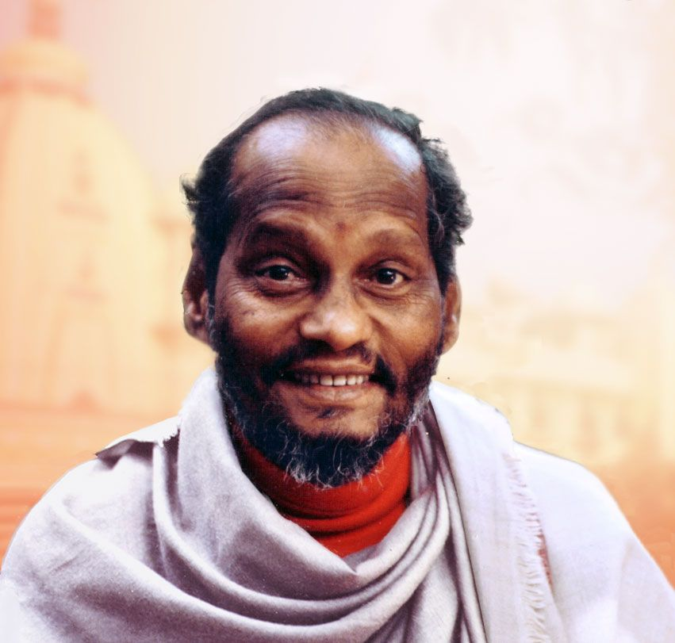
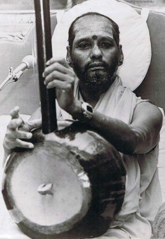
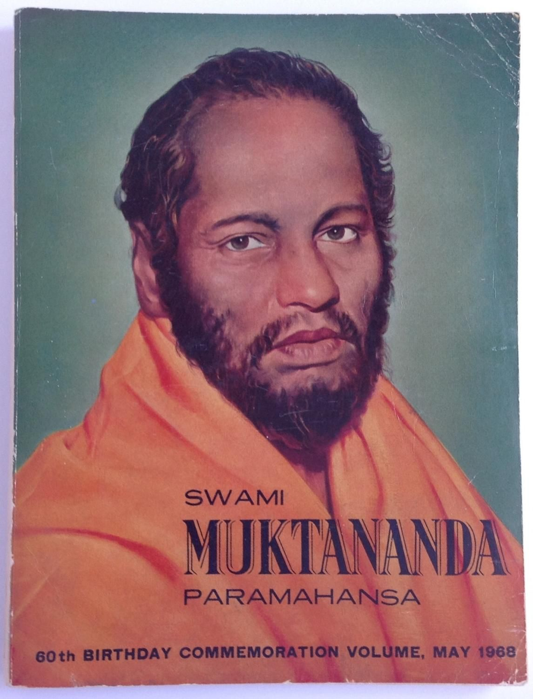
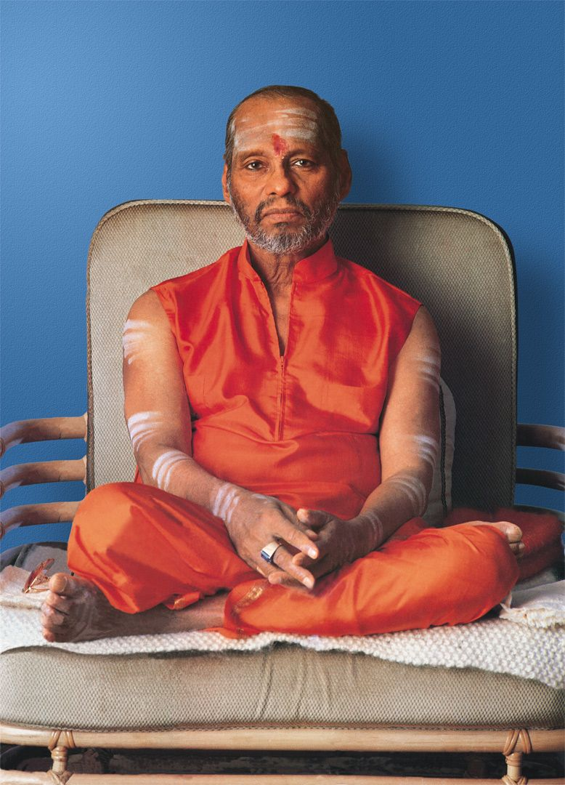
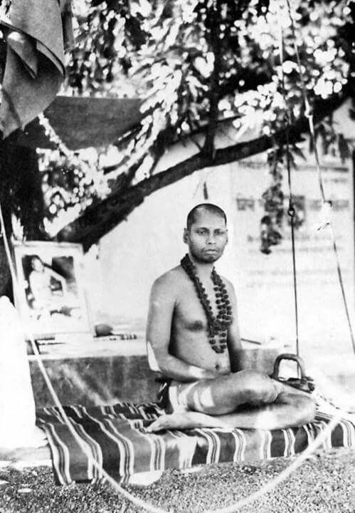
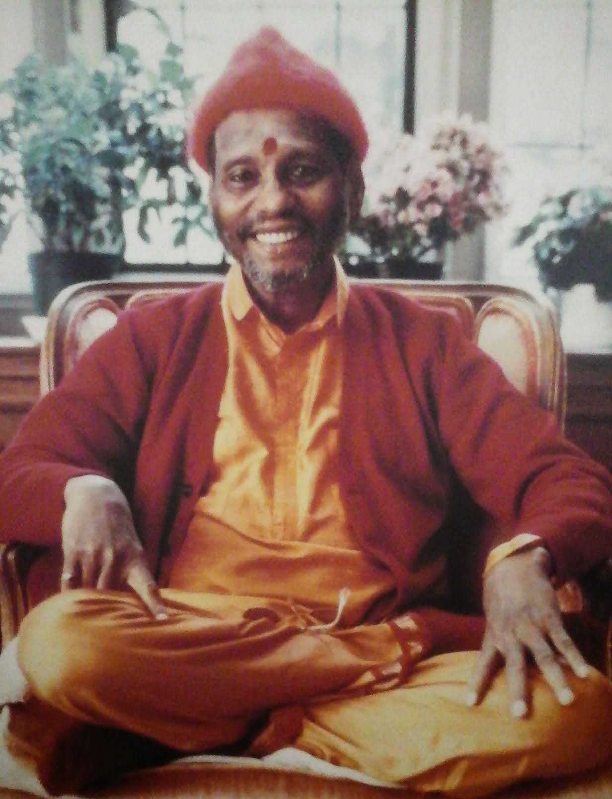

Born Krishna Rai, was a yoga guru, the founder of Siddha Yoga. He was a disciple of Bhagavan Nityananda.

## Biography

Swami Muktananda was born in 1908 near Mangalore in Madras Presidency, British India, to a wealthy family. His birth name was Krishna Rai.

At 15, he encountered Bhagawan Nityananda, a wandering avadhoot who profoundly changed his life. After this encounter, Krishna left home and began his search for the experience of God. He studied under Siddharudha Swami in Hubli, where he learned Sanskrit, Vedanta, and all branches of yoga. He received sannyasa initiation in the Sarasvati order of the Dashanami Sampradaya, taking the name of Swami Muktananda. After Siddharudha's death, Muktananda left to study with a disciple of Siddharudha called Muppinarya Swami at his Sri Airani Holematt in Ranebennur Haveri District. Then Swami Muktananda began wandering India on foot, studying with many different saints and gurus.

In 1947, Muktananda went to Ganeshpuri to receive the darshan of Bhagavan Nityananda, who had originally inspired Muktananda's search for God. He received shaktipat initiation from him on August 15 of that year. Muktananda often said that his spiritual journey did not truly begin until he received shaktipat from Nityananda. He described it as a profound and sublime experience. For the next nine years, Muktananda lived and meditated in a small hut in Yeola. He wrote about his sadhana and kundalini-related meditation experiences in his autobiography.

In 1956, Bhagawan Nityananda acknowledged the culmination of Muktananda's spiritual journey. He appointed Muktananda as the leader of an ashram in Ganeshpuri, near Bombay. The same year he started teaching his Siddha Yoga path. Between 1970 and 1981, Muktananda went on three world tours. During these tours, he established Siddha Yoga ashrams and meditation centers in many countries. In 1975, he founded the Siddha Yoga Ashram in Oakland in the San Francisco Bay area. In 1979, he established Shree Nityananda Ashram (now Shree Muktananda Ashram) in the Catskills, northwest of New York City. Muktananda established Gurudev Siddha Peeth as a public trust in India to administer his work there. He founded the SYDA Foundation in the United States to administer the global work of Siddha Yoga meditation. He wrote many books, sixteen of which are still in print with the SYDA Foundation.

In May 1982, Muktananda appointed two successors, Swami Chidvilasananda and her younger brother, Swami Nityananda, as joint leaders of Siddha Yoga. Nityananda later resigned and formed his own group.

Muktananda died in October 1982. He is buried in his samādhi shrine in Gurudev Siddha Peeth in Ganeshpuri. 

## Teaching and practice

Central to his teachings were to "See God in each other," and "Honor your Self. Worship your Self. Meditate on your Self. God dwells within you as you." Muktananda often gave a shorter version of this teaching: "God dwells within you as you."

According to Lola Williamson, Muktananda was known as a "shaktipat guru because kundalini awakening occurred so readily in his presence". Through Shaktipat Intensives participants were said to receive shaktipat initiation, the awakening of Kundalini Shakti that is said to reside within a person, and to deepen their practice of Siddha Yoga meditation. Historically, Shaktipat initiation had been reserved for the few who had done many years of spiritual service and practices; Muktananda offered this initiation to newcomers and yogis alike. There are several published accounts that describe the reception of shaktipat from Muktananda. Paul Zweig wrote one such account of receiving shaktipat from Muktananda. In Gurus of Modern Yoga, Andrea Jain, in her chapter on Muktananda, quotes an anonymous source, who describes his moment of shaktipat, when he was 19 years old, conferred by Muktananda with a wand of peacock feathers in 1975:

> I almost jumped when the peacock feathers, firmly but with a soft weightiness, hit me repeatedly on my head, and then gently brushed my face as [Muktananda] [...] powerfully pressed one of his fingers into my forehead at a spot located just between my eyebrows [...] I'm honestly somewhat reluctant to write about what happened next because I know that whatever I say will inevitably diminish it, will make it sound as if it were just another "powerful experience." This was not an experience. This was THE event of my spiritual life. This was full awakening. This wasn't "knowing" anything, because you only know something that is separate from you. This was being: the Ultimate - a fountain of Light, a dancing, ever-new source. Utter freedom, utter joy [...] Completely fulfilled, completely whole, no limits to my power and love and light."

[Wikipedia](https://en.wikipedia.org/wiki/Muktananda)

