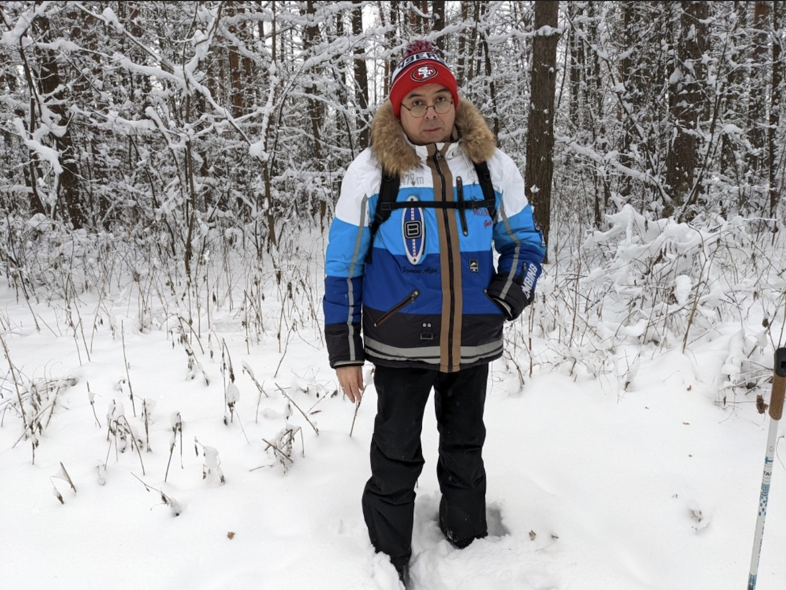
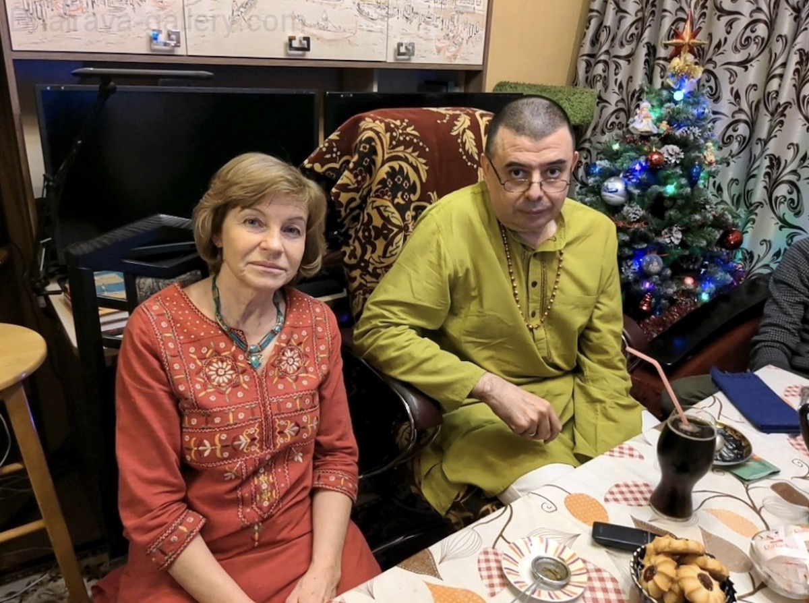
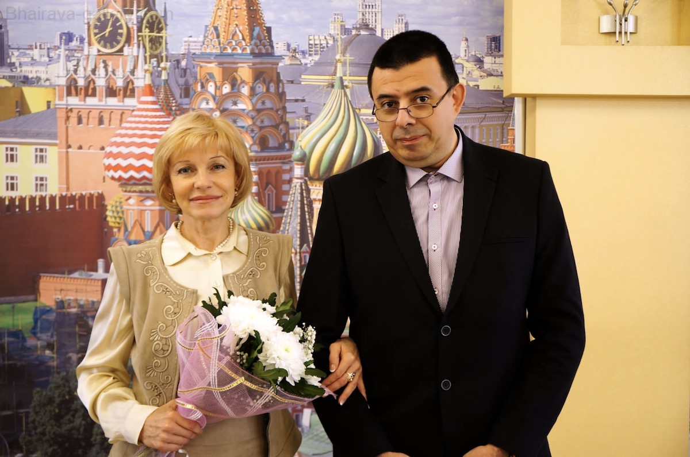

[Веб-сайт Габриеля Прадиипаки](https://www.sanskrit-trikashaivism.com/)

**Spiritual name:** Pradīpaka (lit. "the one who sheds light", i.e. the one who sheds light on the secret meanings of the scriptures).

**Nationality:** Argentinian. He was born in Rosario but lives in Moscow.

**Age:** 58.

**Spiritual lineage:** In 1983 (April) he received spontaneous initiation in the form of Śaktipāta (lit. "descent of Power", i.e. divine Grace) by repeating the sacred mantra "Om̐ namaḥ śivāya" while he was watching a photo of Svāmī Muktānanda. Hence, despite Svāmī Muktānanda having passed away in 1982, Gabriel Pradīpaka considers him to be his Guru. A few months later (October, 1983), he was "formally" initiated by Svāmī Alakṣānanda, also belonging to the Muktānanda's spiritual lineage. As you surely know... or maybe not... Muktānanda is the Master who brought the Siddha Yoga path to the West. Gabriel Pradīpaka was learning/working in the well-known Siddha Yoga community till 1989. Since late 1989 through the end of 1991 and since late 1994 through the end of 1997, he was learning/teaching/working with another teacher (a disciple of the great Muktānanda too), who was crucial in his life as a yogī. And since 1997 he has been on his own.

He also recognizes Svāmī Lakṣmaṇa Joo as his Trika Guru.

In February of 2016, he founded the Parabhairavayoga, a brandnew spiritual movement that is just starting to spread around the world.

In short, he is a spiritual guru, conversant with Sanskrit language and Trika philosophy, who sheds light on spirituality as a whole and helps spiritual aspirants out with the process known as Self-realization or Final Liberation.

**Studies:** Sanskrit, Trika (Non-dual Shaivism of Kashmir), Tantra, Patañjali's Yoga, Sāṅkhya, Vedānta, Vedic rituals, etc. Anyway, his specialty is Trika and Sanskrit. He has been learning/teaching Trika and Sanskrit in depth since 1989.

